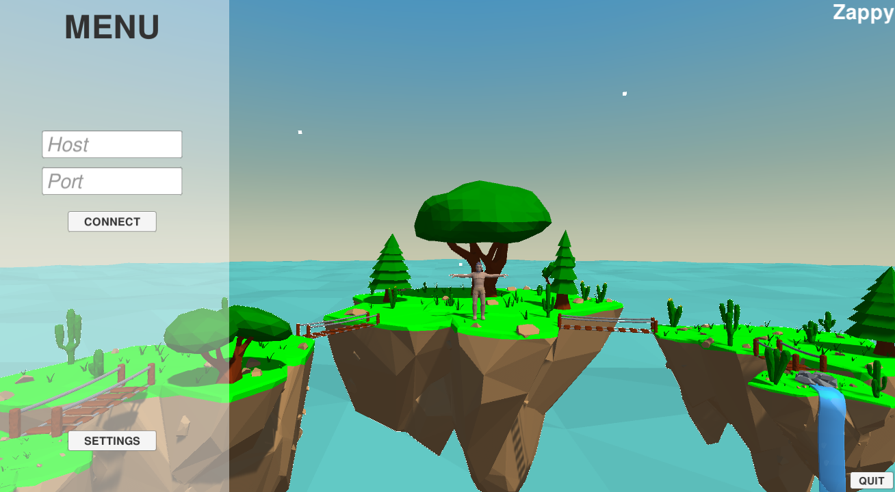
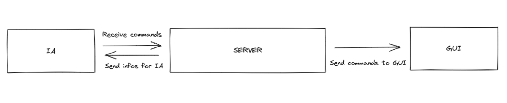
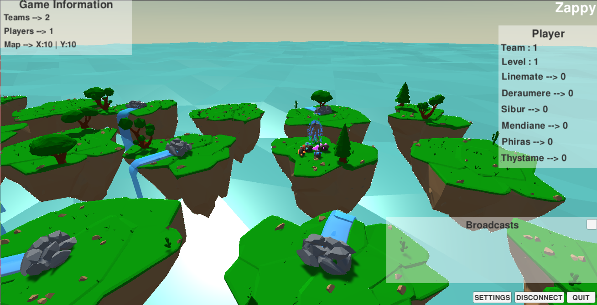
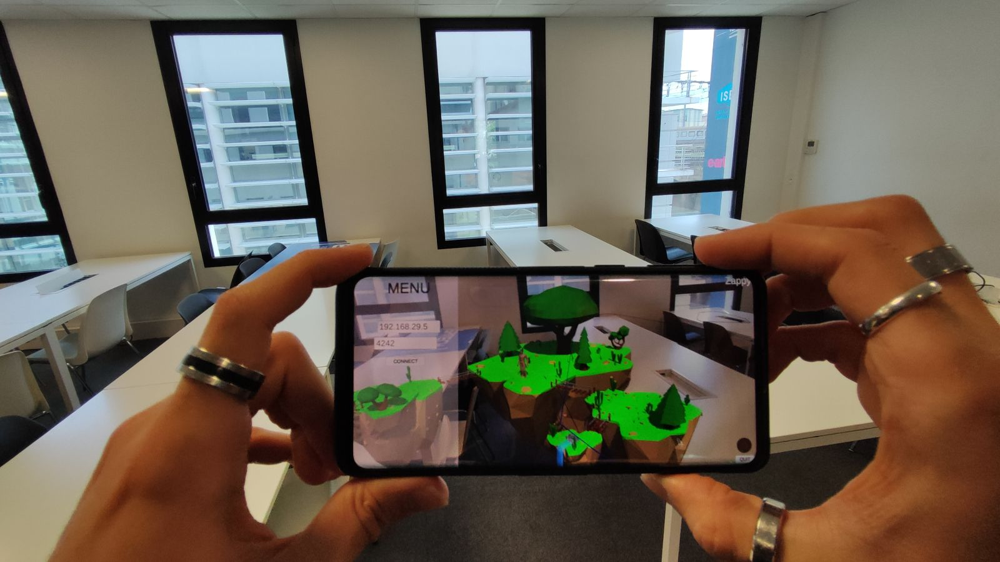

# ⚡️ Zappy
**Epitech Project, 2022 | 2nd Year (PGE)**

## 🔍 Description
The goal of the project is to develop a network game that artificial intelligences will play as a team in order to win the game. The goal of the game itself is to survive and reproduce by collecting resources to perform rituals and level up. The first AI team to reach level 8 wins the game.
The zappy project is separated into three distinct parts :  
&nbsp;&nbsp;&nbsp;&nbsp;&nbsp;&nbsp; 1️⃣&nbsp; [Server](#server) : Allows the progress of the game by establishing communication with the artificial intelligences.  
&nbsp;&nbsp;&nbsp;&nbsp;&nbsp;&nbsp; 2️⃣&nbsp; [GUI](#gui) : Graphical interface connecting to the server in order to follow the progress of the game.  
&nbsp;&nbsp;&nbsp;&nbsp;&nbsp;&nbsp; 3️⃣&nbsp; [AI](#ai) : 
Client connecting to server to play automatically.


The official subject is available [here](./B-YEP-410_zappy.pdf), and the graphic protocol that inspired us [here](./B-YEP-410_zappyProtocole.pdf).  
📄 We were also able to write documentation, available [here](https://zappy.readthedocs.io/en/latest/).
#
## ⚙️ Installation
```
git clone https://github.com/MaximePremont/zappy_epitech.git
cd zappy_epitech
pip3 install -r requirements.txt
make
```
#
## 📝 Start project
Launch the server

```
./zappy_server -p port -x width -y height -n name1 name2 ... -c clientsNb -f freq
```

Launch the GUI 

```
./zappy_gui
```

Launch the AI, it will next create one process per instance.

```
./zappy_ai -p port -n name -h machine
```
For more information, the documentation is available [here](https://zappy.readthedocs.io/en/latest/).
#
## 🚀 Development
### 1️⃣&nbsp; Server
**Developped in C**  
The server controls the data, and sends the information requested by the different clients.\
It uses the TCP protocol, and has been developed in a non-blocking way and able to manage several connections using ``select``. In addition, several good practices have been implemented such as the management of transmitted data using buffers.

It consists of a network layer that handles the clients, and a business layer that handles the players. The separation of these two layers allows a total modularity of each part. 
### 2️⃣&nbsp; GUI
**Developped in C# with Unity**  
To have a better vision of the game, which is simple, clear and ergonomic, we made a user interface with the Unity engine.

In the game, you can see the different islands that represent the tiles of the map. Each island contains food and minerals. The players move between the islands to collect resources. In real time, the information of the map are displayed, as well as the broadcast of the players that can be deciphered. By clicking on the islands or players, we can see what they contain (resources, inventory, …)


### 3️⃣&nbsp; AI
**Developped in Python3**  
Each player of the game is by default inactive, to animate a player the artificial intelligence must take possession of it. To do this, it must communicate with the server and send it precise instructions. Its objective: reach level 8 as soon as possible!

The AI engine is based on a shared inventory algorithm that allows all players in the team to know the resources needed for the incantation.

We use a non-blocking architecture with a circular buffer allowing the data to be stored while performing the optimal actions

```py
def connect_to_server(self):
    self.socket = socket.socket(socket.AF_INET, socket.SOCK_STREAM)
    self.socket.setblocking(False)
    self.socket.connect_ex((self.hostname, safe_cast(self.port, int)))
    events = selectors.EVENT_READ | selectors.EVENT_WRITE
    self.selectors.register(self.socket, events)
```
#
## 💡 Bonus
As a bonus, we have developed a mobile application that integrates the graphic client in augmented reality. The phone connects like a classic client on the network to communicate with the server on the machine.


### **&nbsp;&nbsp; 💿 Full demo available [here](https://youtu.be/DI_l7lQiE4U) !**
#
## ❤️ Contributors
&nbsp;&nbsp;&nbsp;&nbsp;&nbsp;&nbsp; 📌 [PREMONT Maxime](https://github.com/MaximePremont) &nbsp;&nbsp;👉&nbsp;&nbsp; [GUI](./Gui/) + [AR (Bonus)](./Gui/Unity_AR_project/)  
&nbsp;&nbsp;&nbsp;&nbsp;&nbsp;&nbsp; 📌 [SABRE Nolann](https://github.com/Nolann71) &nbsp;&nbsp;👉&nbsp;&nbsp; [Server](./Server/)  
&nbsp;&nbsp;&nbsp;&nbsp;&nbsp;&nbsp; 📌 [ABOUELLEIL-SAYED Ahmed](https://github.com/AhmedFr) &nbsp;&nbsp;👉&nbsp;&nbsp; [Server](./Server/)  
&nbsp;&nbsp;&nbsp;&nbsp;&nbsp;&nbsp; 📌 [VALLENET Mikael](https://github.com/Mikatech) &nbsp;&nbsp;👉&nbsp;&nbsp; [AI](./Ai/)  
&nbsp;&nbsp;&nbsp;&nbsp;&nbsp;&nbsp; 📌 [FERRARD Yannick](https://github.com/YannickTektek) &nbsp;&nbsp;👉&nbsp;&nbsp; [AI](./Ai/)  
&nbsp;&nbsp;&nbsp;&nbsp;&nbsp;&nbsp; 📌 [CARNEIRO Lucien](https://github.com/lucien-carneiro) &nbsp;&nbsp;👉&nbsp;&nbsp; [GUI](./Gui/) + [Documentation](./zappy-documentation.pdf)


Special thanks to [VALLENET Mikael](https://github.com/Mikatech) who allowed the use of [his readme](https://github.com/Mikatech/Zappy/blob/main/README.md) to write this one.